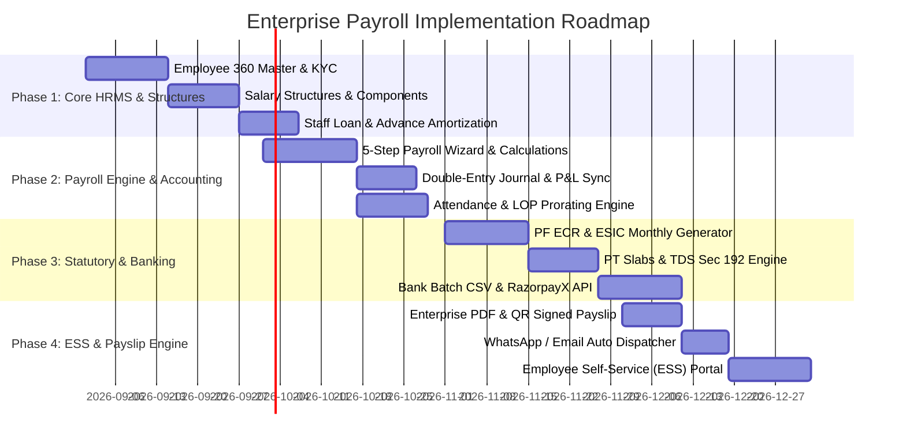

# Enterprise Payroll System: Full Audit, Gap Analysis & Strategic Roadmap
**Platform:** VyaparSathi (vyaparsathi-backend & vyaparsathi-frontend)  
**Comparative Benchmarks:** Zoho Books, SAP SuccessFactors, RazorpayX Payroll, Gusto, Workday  
**Document Version:** 1.0 (Production Blueprint)  
**Status:** Audit Completed & Architectural Blueprint Ready

---

## 1. Executive Summary & Maturity Assessment

VyaparSathi currently has a **Level 1 (Basic/MVP) Payroll Implementation**. It provides a single-table staff list, a static flat-base salary field, an informal advance balance, and a single-click payout record that generates a client-side PDF.

To scale VyaparSathi into a world-class, enterprise-grade SaaS platform comparable to **Zoho Books, SAP SuccessFactors, and RazorpayX Payroll**, the payroll subsystem requires an architectural upgrade across **6 Core Pillars**:

```
┌───────────────────────────────────────────────────────────────────────────────────┐
│                           ENTERPRISE PAYROLL MATURITY                             │
├───────────────────────┬─────────────────────────┬─────────────────────────────────┤
│ Pillar                │ Current State (MVP)     │ Target State (Zoho / SAP Level) │
├───────────────────────┼─────────────────────────┼─────────────────────────────────┤
│ 1. Core Architecture  │ Flat table, base salary │ Configurable Salary Structures  │
│                       │ + bonus - deduction     │ (Basic, HRA, DA, Allowances)    │
├───────────────────────┼─────────────────────────┼─────────────────────────────────┤
│ 2. Accounting Sync    │ None (Orphan records)   │ Automated Double-Entry Journal  │
│                       │                         │ Posting (P&L, Cash/Bank, Taxes) │
├───────────────────────┼─────────────────────────┼─────────────────────────────────┤
│ 3. Statutory Engine   │ 0% compliance support   │ Automated PF (ECR), ESI, PT,    │
│                       │                         │ TDS (Sec 192), Form 16 & 24Q    │
├───────────────────────┼─────────────────────────┼─────────────────────────────────┤
│ 4. Attendance & LOP   │ Fixed 100% payout       │ Biometric/Timesheet Sync, LOP,  │
│                       │                         │ Overtime, Shift Differential    │
├───────────────────────┼─────────────────────────┼─────────────────────────────────┤
│ 5. Payout Rails       │ Manual entry only       │ 1-Click Bank API (RazorpayX) +  │
│                       │                         │ NACH/NEFT Bank Batch Files      │
├───────────────────────┼─────────────────────────┼─────────────────────────────────┤
│ 6. Lifecycle & UX     │ Single modal popups     │ 5-Step Guided Run Stepper, ESS  │
│                       │                         │ Portal, Maker-Checker Approvals │
└───────────────────────┴─────────────────────────┴─────────────────────────────────┘
```

---

## 2. In-Depth Codebase Audit

### 2.1 Backend Audit (`vyaparsathi-backend`)

#### A. Database Schema (`V16__update_notification_add_staff_payroll_table.sql`)
* **`staff` Table:**
  * **Fields:** `id`, `shop_id`, `name`, `phone`, `role`, `base_salary`, `advance_balance`, `joining_date`, `active`.
  * **Gaps:** Missing employee ID (`EMP001`), email, PAN, Aadhaar, bank details (account number, IFSC, branch, beneficiary name), department, designation, employment type (Full-Time, Contract, Intern), tax regime, PF UAN, ESIC IP number, emergency contact, document attachments.
* **`payroll_record` Table:**
  * **Fields:** `id`, `shop_id`, `staff_id`, `salary_month`, `salary_year`, `payment_date`, `base_salary_at_time`, `bonus`, `deductions`, `advance_deduction`, `net_amount`, `status`, `payment_mode`, `remarks`.
  * **Gaps:** Lacks granular breakdown of allowances (HRA, Special, DA, Conveyance, Overtime) and statutory deductions (Employee PF, Employer PF, Employee ESI, Employer ESI, PT, TDS, LWF). Lacks batch ID, approval tracking, bank account linkage, and transaction UTR.

#### B. Service & Business Logic (`PayrollService.java`)
* **Financial Integrity:** Computes `baseSalary + bonus - deductions - advanceDeduction`. No dynamic formula execution, no attendance-based prorating (e.g. `(baseSalary / totalDays) * payableDays`).
* **Accounting Disconnection:** `processSalary` saves the record but **never updates General Ledger or Expense accounts**. In financial reporting (`AccountingService.java` P&L calculation), payroll expenses are completely missing unless a user manually enters a separate expense.
* **Advance Logic:** Advances are stored as a flat mutating float on the `Staff` record (`staff.setAdvanceBalance(...)`). No historical loan ledger, interest calculation, or automated multi-month EMI amortization schedules.
* **Bulk Processing:** `processBulkSalary` simply maps over the single process method with zero bonuses and zero deductions, which is unrealistic for actual monthly payroll runs.

#### C. Controllers & Security (`PayrollController.java`)
* Missing granular Role-Based Access Control (RBAC). A user with shop access can execute payroll without dual approval (Maker-Checker).
* No locking mechanism for closed financial payroll cycles.

---

### 2.2 Frontend Audit (`vyaparsathi-frontend`)

#### A. Architecture & Routing (`AppRoutes.jsx`, `api.js`, `endpoints.js`)
* Payroll is guarded by `<TierGuard requiredTier="ENTERPRISE">` on `/admin/payroll` and `/payroll/history/:staffId`.
* Endpoints defined:
  * `GET /api/payroll/staff`
  * `POST /api/payroll/staff`
  * `POST /api/payroll/staff/:id/advance`
  * `POST /api/payroll/process`
  * `POST /api/payroll/process/bulk`
  * `GET /api/payroll/history/staff/:staffId`

#### B. UI & Component Experience (`PayrollDashboard.jsx`, `PayrollTable.jsx`, `ProcessSalaryModal.js`)
* **Dashboard:** Basic summary cards (`Total Base Liability`, `Active Staff`, `Total Advances`, `Debt Exposure`).
* **Table:** Simple listing with individual "Pay Now" and "Advance" buttons.
* **Modals:**
  * `ProcessSalaryModal.js`: Basic input form with manual bonus/deduction fields.
  * `AdvancePaymentModal.jsx`: Basic one-off amount entry.
* **Payslip (`PaymentHistoryPage.jsx`):** Generates client-side PDF using `jspdf` and `jspdf-autotable`. Lacks company logo upload, authorized signature block, statutory breakdowns, leave balance summary, and server-side verifiable digital signatures.

---

## 3. Comprehensive Enterprise Gap Analysis

| Category | Missing Enterprise Capability | Business & Technical Impact |
| :--- | :--- | :--- |
| **1. Accounting & General Ledger** | Automated Double-Entry Journal creation upon payroll disbursal. | Financial statements (P&L, Balance Sheet, Cash Flow) misstate company profitability and cash position. |
| **2. Statutory Compliance** | Automated EPF (12% + 12%), ESIC (0.75% + 3.25%), PT (State slabs), TDS (Sec 192). | High risk of regulatory non-compliance, statutory audits penalties, and labor law fines for enterprises. |
| **3. Salary Structuring** | Component-based CTC breakdown (Basic, HRA, Special, DA, Conveyance, Medical). | Cannot support diverse employee grades, executive tax optimizations, or structured compensation. |
| **4. Attendance & Leaves (LOP)** | Biometric attendance integration, Loss of Pay (LOP) calculations, overtime tracking. | Overpaying employees or forcing tedious manual Excel recalculations before every pay cycle. |
| **5. Banking & Payout Rails** | Direct payment gateway/bank integration (RazorpayX / Cashfree) and NEFT/RTGS batch file export. | Payroll administrators must manually log in to corporate bank accounts and make one-by-one transfers. |
| **6. Loan & Advance Amortization** | Structured staff loans, interest rates, installment plans (EMI), auto-deduction schedules. | Financial leakage, tracking errors, and disputes between employees and accounting. |
| **7. Workflow & Maker-Checker** | Draft $\rightarrow$ Review $\rightarrow$ Approval $\rightarrow$ Disbursal $\rightarrow$ Reconciled stages. | Lack of internal controls; high risk of unauthorized payouts and human errors. |
| **8. Employee Self-Service (ESS)** | Employee portal/view to download payslips, submit tax declarations, request advances. | HR/Admin burdened with repetitive manual requests for payslips and tax certificates. |

---

## 4. Enterprise Architecture & Data Model Blueprint

To achieve Zoho Books & SAP grade architecture, we introduce a modular domain architecture.

```
                                  ┌────────────────────────┐
                                  │      Shop / Tenant     │
                                  └───────────┬────────────┘
                                              │
                    ┌─────────────────────────┼─────────────────────────┐
                    ▼                         ▼                         ▼
         ┌─────────────────────┐   ┌─────────────────────┐   ┌─────────────────────┐
         │   Salary Structure  │   │   Employee Master   │   │  Statutory Config   │
         │   & Component Rules │   │  (KYC, Bank, Dept)  │   │  (PF, ESI, PT, TDS) │
         └──────────┬──────────┘   └──────────┬──────────┘   └──────────┬──────────┘
                    │                         │                         │
                    └─────────────────────────┼─────────────────────────┘
                                              ▼
                                 ┌─────────────────────────┐
                                 │       Payroll Run       │
                                 │   (Cycle: Month/Year)   │
                                 └────────────┬────────────┘
                                              ▼
                    ┌───────────────────────────────────────────────────┐
                    │               Payroll Slip / Item                 │
                    │  (Earnings, Deductions, Net Pay, LOP, Overtime)   │
                    └──────────┬────────────────────────────┬───────────┘
                               │                            │
                               ▼                            ▼
                 ┌──────────────────────────┐  ┌──────────────────────────┐
                 │  Double-Entry Accounting │  │   Bank Payout Engine     │
                 │  Journal Vouchers / P&L  │  │  (RazorpayX / Batch CSV) │
                 └──────────────────────────┘  └──────────────────────────┘
```

### 4.1 Proposed Database Entity Relational Model

#### 1. `employees` (Extends `staff` into full HRMS profile)
```sql
CREATE TABLE IF NOT EXISTS `employees` (
    `id` BIGINT AUTO_INCREMENT PRIMARY KEY,
    `shop_id` BIGINT NOT NULL,
    `employee_code` VARCHAR(50) NOT NULL, -- e.g. EMP-001
    `first_name` VARCHAR(100) NOT NULL,
    `last_name` VARCHAR(100),
    `email` VARCHAR(150),
    `phone` VARCHAR(20) NOT NULL,
    `gender` ENUM('MALE', 'FEMALE', 'OTHER'),
    `date_of_birth` DATE,
    `joining_date` DATE NOT NULL,
    `exit_date` DATE,
    `employment_status` ENUM('ACTIVE', 'PROBATION', 'NOTICE_PERIOD', 'TERMINATED', 'RESIGNED') DEFAULT 'ACTIVE',
    `employment_type` ENUM('FULL_TIME', 'PART_TIME', 'CONTRACTOR', 'INTERN') DEFAULT 'FULL_TIME',
    `department_id` BIGINT,
    `designation` VARCHAR(100),
    
    -- Banking & Payout Details
    `bank_account_number` VARCHAR(50),
    `bank_ifsc_code` VARCHAR(20),
    `bank_name` VARCHAR(100),
    `bank_branch` VARCHAR(100),
    `bank_beneficiary_name` VARCHAR(100),
    `upi_id` VARCHAR(100),
    `payment_preference` ENUM('BANK_TRANSFER', 'UPI', 'CASH', 'CHEQUE') DEFAULT 'BANK_TRANSFER',

    -- Statutory & Tax KYC
    `pan_number` VARCHAR(10),
    `aadhaar_number` VARCHAR(12),
    `uan_number` VARCHAR(12), -- Universal Account Number (PF)
    `pf_enrolled` BOOLEAN DEFAULT FALSE,
    `esic_number` VARCHAR(17),
    `esic_enrolled` BOOLEAN DEFAULT FALSE,
    `pt_state` VARCHAR(50), -- e.g. 'MAHARASHTRA', 'KARNATAKA'
    `tax_regime` ENUM('NEW_REGIME', 'OLD_REGIME') DEFAULT 'NEW_REGIME',

    `salary_structure_id` BIGINT,
    `monthly_ctc` DECIMAL(12, 2) NOT NULL DEFAULT 0.00,
    `created_at` TIMESTAMP DEFAULT CURRENT_TIMESTAMP,
    `updated_at` TIMESTAMP DEFAULT CURRENT_TIMESTAMP ON UPDATE CURRENT_TIMESTAMP,

    UNIQUE KEY `uk_shop_emp_code` (`shop_id`, `employee_code`),
    INDEX `idx_shop_status` (`shop_id`, `employment_status`)
) ENGINE=InnoDB DEFAULT CHARSET=utf8mb4 COLLATE=utf8mb4_unicode_ci;
```

#### 2. `salary_structures` & `salary_components`
```sql
CREATE TABLE IF NOT EXISTS `salary_structures` (
    `id` BIGINT AUTO_INCREMENT PRIMARY KEY,
    `shop_id` BIGINT NOT NULL,
    `name` VARCHAR(100) NOT NULL, -- e.g. "Standard Full-Time Grade A"
    `description` TEXT,
    `is_active` BOOLEAN DEFAULT TRUE,
    `created_at` TIMESTAMP DEFAULT CURRENT_TIMESTAMP
);

CREATE TABLE IF NOT EXISTS `salary_components` (
    `id` BIGINT AUTO_INCREMENT PRIMARY KEY,
    `shop_id` BIGINT NOT NULL,
    `structure_id` BIGINT NOT NULL,
    `name` VARCHAR(100) NOT NULL, -- e.g. "Basic Salary", "HRA", "Special Allowance", "PF"
    `code` VARCHAR(50) NOT NULL,  -- e.g. "BASIC", "HRA", "SPECIAL_ALLOW", "EPF_EE"
    `type` ENUM('EARNING', 'DEDUCTION', 'EMPLOYER_CONTRIBUTION') NOT NULL,
    `calculation_type` ENUM('FLAT_AMOUNT', 'PERCENTAGE_OF_BASIC', 'PERCENTAGE_OF_GROSS', 'FORMULA') NOT NULL,
    `calculation_value` DECIMAL(10, 4) NOT NULL DEFAULT 0.0000,
    `is_taxable` BOOLEAN DEFAULT TRUE,
    `affects_pf` BOOLEAN DEFAULT TRUE,
    `affects_esi` BOOLEAN DEFAULT TRUE,
    `is_statutory` BOOLEAN DEFAULT FALSE,
    CONSTRAINT `fk_comp_struct` FOREIGN KEY (`structure_id`) REFERENCES `salary_structures` (`id`) ON DELETE CASCADE
);
```

#### 3. `payroll_runs` (Master Monthly Batch)
```sql
CREATE TABLE IF NOT EXISTS `payroll_runs` (
    `id` BIGINT AUTO_INCREMENT PRIMARY KEY,
    `shop_id` BIGINT NOT NULL,
    `run_number` VARCHAR(50) NOT NULL, -- e.g. "PAY-2026-08"
    `payroll_month` VARCHAR(20) NOT NULL,
    `payroll_year` INT NOT NULL,
    `start_date` DATE NOT NULL,
    `end_date` DATE NOT NULL,
    `calendar_days` INT NOT NULL,
    
    -- Status Lifecycle: DRAFT -> PROCESSING -> PENDING_APPROVAL -> APPROVED -> DISBURSED -> VOID
    `status` ENUM('DRAFT', 'PROCESSING', 'PENDING_APPROVAL', 'APPROVED', 'DISBURSED', 'VOID') DEFAULT 'DRAFT',
    
    -- Financial Aggregates
    `total_employees` INT DEFAULT 0,
    `total_gross_earnings` DECIMAL(14, 2) DEFAULT 0.00,
    `total_employee_deductions` DECIMAL(14, 2) DEFAULT 0.00,
    `total_net_payable` DECIMAL(14, 2) DEFAULT 0.00,
    `total_employer_contributions` DECIMAL(14, 2) DEFAULT 0.00,
    `total_company_cost` DECIMAL(14, 2) DEFAULT 0.00,

    -- Approvals & Execution
    `prepared_by_user_id` BIGINT,
    `approved_by_user_id` BIGINT,
    `approved_at` TIMESTAMP NULL,
    `disbursed_at` TIMESTAMP NULL,
    `shop_bank_account_id` BIGINT,
    `accounting_journal_id` BIGINT, -- Linked to double-entry ledger voucher

    `created_at` TIMESTAMP DEFAULT CURRENT_TIMESTAMP,
    `updated_at` TIMESTAMP DEFAULT CURRENT_TIMESTAMP ON UPDATE CURRENT_TIMESTAMP,
    UNIQUE KEY `uk_shop_month_year` (`shop_id`, `payroll_month`, `payroll_year`)
);
```

#### 4. `payroll_slips` & `payroll_slip_items` (Detailed Itemized Slips)
```sql
CREATE TABLE IF NOT EXISTS `payroll_slips` (
    `id` BIGINT AUTO_INCREMENT PRIMARY KEY,
    `payroll_run_id` BIGINT NOT NULL,
    `shop_id` BIGINT NOT NULL,
    `employee_id` BIGINT NOT NULL,
    `slip_number` VARCHAR(50) NOT NULL, -- e.g. "SLIP-202608-001"
    
    -- Attendance Breakdown
    `total_days` INT NOT NULL,
    `working_days` INT NOT NULL,
    `present_days` DECIMAL(4, 1) NOT NULL,
    `paid_leaves` DECIMAL(4, 1) DEFAULT 0.0,
    `loss_of_pay_days` DECIMAL(4, 1) DEFAULT 0.0,
    `overtime_hours` DECIMAL(5, 2) DEFAULT 0.0,

    -- Financial Breakdown
    `monthly_base_salary` DECIMAL(12, 2) NOT NULL,
    `gross_earnings` DECIMAL(12, 2) NOT NULL,
    `total_deductions` DECIMAL(12, 2) NOT NULL,
    `net_salary` DECIMAL(12, 2) NOT NULL,
    `employer_contributions` DECIMAL(12, 2) NOT NULL,
    `total_ctc` DECIMAL(12, 2) NOT NULL,

    -- Statutory Split
    `epf_employee` DECIMAL(10, 2) DEFAULT 0.00,
    `epf_employer` DECIMAL(10, 2) DEFAULT 0.00,
    `esi_employee` DECIMAL(10, 2) DEFAULT 0.00,
    `esi_employer` DECIMAL(10, 2) DEFAULT 0.00,
    `professional_tax` DECIMAL(10, 2) DEFAULT 0.00,
    `tds_tax` DECIMAL(10, 2) DEFAULT 0.00,
    `loan_advance_deduction` DECIMAL(10, 2) DEFAULT 0.00,

    -- Payout Tracking
    `payout_status` ENUM('UNPAID', 'QUEUED', 'PAID', 'FAILED') DEFAULT 'UNPAID',
    `payment_mode` VARCHAR(30),
    `bank_utr_reference` VARCHAR(100),
    `disbursed_on` DATE,
    `pdf_document_url` VARCHAR(255),

    CONSTRAINT `fk_slip_run` FOREIGN KEY (`payroll_run_id`) REFERENCES `payroll_runs` (`id`) ON DELETE CASCADE,
    CONSTRAINT `fk_slip_emp` FOREIGN KEY (`employee_id`) REFERENCES `employees` (`id`)
);

CREATE TABLE IF NOT EXISTS `payroll_slip_items` (
    `id` BIGINT AUTO_INCREMENT PRIMARY KEY,
    `payroll_slip_id` BIGINT NOT NULL,
    `component_name` VARCHAR(100) NOT NULL,
    `component_type` ENUM('EARNING', 'DEDUCTION', 'EMPLOYER_CONTRIBUTION') NOT NULL,
    `amount` DECIMAL(10, 2) NOT NULL,
    CONSTRAINT `fk_item_slip` FOREIGN KEY (`payroll_slip_id`) REFERENCES `payroll_slips` (`id`) ON DELETE CASCADE
);
```

#### 5. `staff_loans` & `staff_loan_repayments` (Amortization Engine)
```sql
CREATE TABLE IF NOT EXISTS `staff_loans` (
    `id` BIGINT AUTO_INCREMENT PRIMARY KEY,
    `shop_id` BIGINT NOT NULL,
    `employee_id` BIGINT NOT NULL,
    `loan_type` ENUM('SALARY_ADVANCE', 'EMERGENCY_LOAN', 'EQUIPMENT_LOAN') NOT NULL,
    `principal_amount` DECIMAL(12, 2) NOT NULL,
    `interest_rate_annual` DECIMAL(5, 2) DEFAULT 0.00,
    `tenure_months` INT NOT NULL DEFAULT 1,
    `monthly_emi` DECIMAL(12, 2) NOT NULL,
    `total_repaid` DECIMAL(12, 2) DEFAULT 0.00,
    `remaining_balance` DECIMAL(12, 2) NOT NULL,
    `disbursement_date` DATE NOT NULL,
    `recovery_start_month` VARCHAR(20) NOT NULL,
    `status` ENUM('ACTIVE', 'CLOSED', 'DEFAULTED') DEFAULT 'ACTIVE',
    `remarks` TEXT
);
```

---

## 5. Double-Entry Accounting & Ledger Posting Engine

When a Payroll Run is marked **DISBURSED**, the backend will automatically generate balanced Journal Entries across the Chart of Accounts:

```
─────────────────────────────────────────────────────────────────────────────────
TRANSACTION: Monthly Payroll Run Disbursement (e.g. Total Gross ₹5,00,000)
─────────────────────────────────────────────────────────────────────────────────

  ACCOUNT                                   DEBIT (₹)          CREDIT (₹)
─────────────────────────────────────────────────────────────────────────────────
  [Expense] Salaries & Wages Expense        5,00,000.00                 -
  [Expense] Employer PF Contribution          24,000.00                 -
  [Expense] Employer ESI Contribution          6,500.00                 -
  
  [Liability] PF Payable (EE + ER)                    -         48,000.00
  [Liability] ESI Payable (EE + ER)                   -          8,000.00
  [Liability] Professional Tax (PT) Payable           -          4,000.00
  [Liability] TDS / Income Tax (Sec 192)              -         35,000.00
  [Asset] Staff Advance / Loan Recovery               -         25,000.00
  [Asset/Bank] Shop Operating Bank Account            -       4,10,500.00
─────────────────────────────────────────────────────────────────────────────────
  TOTAL BALANCED ENTRY                      5,30,500.00       5,30,500.00
─────────────────────────────────────────────────────────────────────────────────
```

---

## 6. Statutory Compliance Engine (India & Global)

### 6.1 Employees' Provident Fund (EPF)
* **Rule:** 12% of Basic + DA (capped at ₹15,000 wage ceiling unless opt-in).
* **Employer Split:** 3.67% EPF + 8.33% EPS (capped at ₹1,250) + 0.5% EDLI + 0.5% Admin.
* **Output:** Auto-generation of EPFO **ECR Text File (.txt)** format for direct portal upload.

### 6.2 Employees' State Insurance (ESIC)
* **Rule:** Gross wages $\le$ ₹21,000/month.
* **Employee:** 0.75% of Gross.
* **Employer:** 3.25% of Gross.
* **Output:** Monthly ESIC Return Excel file.

### 6.3 Professional Tax (PT)
* State-specific automated slabs (e.g. Maharashtra ₹200/mo, ₹300 in Feb; Karnataka ₹200/mo for wages $\ge$ ₹15,000; West Bengal graded slabs).

### 6.4 Tax Deducted at Source (TDS under Sec 192) & Form 16
* Annual tax forecasting module (incorporating standard deduction ₹75,000 for New Regime, 80C/80D for Old Regime).
* Auto-generated **Form 16 Part A & Part B** at year-end.

---

## 7. Payout Rails & Banking Integrations

1. **1-Click Direct Disbursal via API:**
   * **RazorpayX / Cashfree Payouts API:** Disburse salaries directly to employee bank accounts or UPI IDs with instant webhook status reconciliation.
2. **Corporate Banking Batch Export (NACH/NEFT):**
   * Pre-formatted CSV/Excel upload templates for:
     * **HDFC Enet / Corporate Banking**
     * **ICICI Corporate Bulk Pay**
     * **SBI Corporate Net Banking (CMP)**
     * **Axis Bank Bulk Upload**

---

## 8. Enterprise UI/UX Design System & Wizard

### 8.1 5-Step Guided Payroll Processing Stepper

```
┌───────────────────────────────────────────────────────────────────────────────────────┐
│                          MONTHLY PAYROLL RUN: AUGUST 2026                             │
├─────────────┬─────────────────┬─────────────────┬──────────────────┬──────────────────┤
│   STEP 1    │     STEP 2      │     STEP 3      │      STEP 4      │      STEP 5      │
│ Attendance  │  Earnings & OT  │ Deductions & PT │ Review & Impact  │ Direct Payout &  │
│    & LOP    │    Incentives   │   Taxes & Loan  │ P&L / Cashflow   │ Batch Generator  │
└─────────────┴─────────────────┴─────────────────┴──────────────────┴──────────────────┘
```

#### Step 1: Attendance & Leaves (LOP)
* Table displaying Total Days, Working Days, Present Days, Paid Leaves, Unpaid Leaves (LOP).
* Visual alert indicating financial deduction amount per employee for unpaid absences.

#### Step 2: Earnings, Bonuses & Overtime
* Inline table editing for overtime hours, performance bonuses, travel reimbursements, and arrears.

#### Step 3: Deductions, Statutory & Loan Recoveries
* Auto-calculated PF, ESI, PT, TDS, and scheduled Loan EMI recoveries with override controls.

#### Step 4: Summary & P&L Impact Preview
* High-impact visual dashboard showcasing:
  * Total Net Payout vs Last Month
  * Company CTC Impact
  * Employer Statutory Liabilities
  * Real-time Bank Balance Validation check

#### Step 5: Disbursal & Payslip Dispatch
* Dual CTA: `1-Click Direct Bank Disbursal (RazorpayX)` or `Download Bank NEFT Batch File`.
* Toggle switch: `Auto-dispatch Payslips via WhatsApp & Email`.

---

## 9. Phased Implementation Roadmap



---

## 10. Summary of Deliverables & Action Items

1. **Backend Database:** Execute Flyway migration introducing `employees`, `salary_structures`, `salary_components`, `payroll_runs`, `payroll_slips`, and `staff_loans`.
2. **Accounting Hook:** Attach `AccountingService.createJournalEntry()` on `PayrollRun.status == DISBURSED`.
3. **Frontend Redesign:** Replace single table with Enterprise HRMS Suite comprising **Employee Directory**, **Salary Structure Configurator**, **5-Step Monthly Run Stepper**, **Loan Ledger**, and **Statutory Compliance Exporter**.
4. **Communication:** Add background worker for automated multi-channel payslip delivery via WhatsApp Cloud API & SendGrid/SES.
